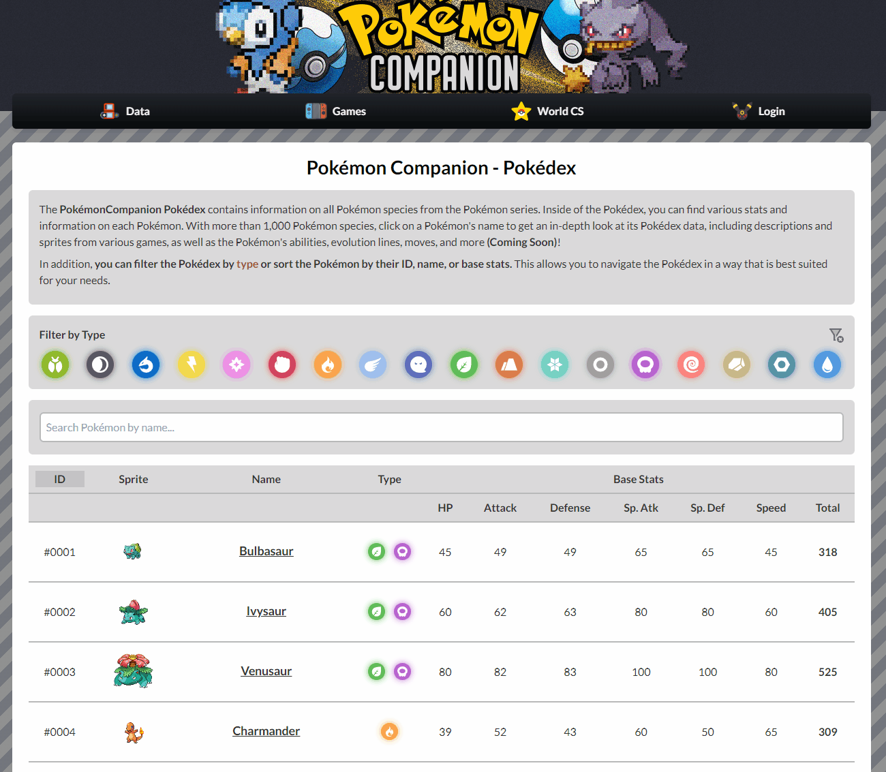

# PokéCompanion

[](https://opensource.org/licenses/MIT)

## Table of Contents

- [Description](#description)
- [Features](#features)
- [GIFs](#gifs)
- [Links](#links)
- [Usage](#usage)
- [Technologies](#technologies)
- [Credits](#credits)

## Description

**PokéCompanion is a comprehensive web application designed to be the ultimate resource for Pokémon enthusiasts.** Whether you're a seasoned Trainer or a casual fan, PokéCompanion offers a one-stop hub where you can explore detailed Pokédex information, including stats, abilities, evolution chains, encounter locations, and much more. Dive deep into the world of Pokémon with access to a rich database of moves, items, and abilities, all seamlessly integrated for easy navigation.

In addition to providing in-depth Pokémon data, PokéCompanion features an exciting **World Coronation Series** — **a 1v1 battle simulator where users can select their favorite Pokémon and engage in competitive battles.** Whether you're honing your skills or experimenting with new strategies, the battle simulator brings the thrill of Pokémon combat to life.

**Built using the MERN stack (MongoDB, Express, React, Node.js),** PokéCompanion delivers a smooth and dynamic user experience. **Leveraging the power of PokéAPI,** the platform ensures that users have access to the latest Pokémon data, with real-time updates to reflect new generations, game mechanics, and Pokémon releases.

Designed with both casual users and competitive players in mind, **PokéCompanion is more than just a Pokédex** — it's a vibrant community hub for all things Pokémon, offering tools, insights, and features to enhance your journey as a Pokémon Trainer.

## Features

- **Pokédex**: Explore detailed information on all Pokémon species, including stats, abilities, types, evolution chains, and more.
- **Moves, Items, Abilities**: Access comprehensive databases of moves, items, and abilities to enhance your Pokémon knowledge.
- **World Coronation Series**: Engage in 1v1 battles with your favorite Pokémon, experiment with strategies, and climb the ranks in the battle simulator.
- **Filter & Sort**: Easily search for Pokémon based on various criteria, such as type, generation, and base stats.
- **Responsive Design**: Enjoy a seamless user experience across desktop, tablet, and mobile devices.
- **Real-Time Updates**: Stay up-to-date with the latest Pokémon data, including new generations, game mechanics, and releases.
- **Battle Simulator Rankings**: Track your progress as you climb the ranks in the 1v1 battle system.

## GIFs

### Pokedex Filter/Sort



## Links

- [PokéAPI](https://pokeapi.co), the tool that powers PokéCompanion
- [PokéCompanion](https://www.poke-companion.com), the web application

## Usage

1. **Clone the repository:**

   ```bash
   git clone
   ```

2. **Install the dependencies:**

   ```bash
   npm install
   ```

3. **Create server .env with the following content:**

   ```bash
   JWT_SECRET=your_secret
   ```

4. **Run the server:**

   ```bash
   npm run start
   ```

5. **Run the client:**

   ```bash
   cd client
   npm run start
   ```

6. **Access the application:**

   Open your browser and go to `http://localhost:5173/`

## Technologies

- **MongoDB:** NoSQL database for storing Pokémon and user data.
- **Express:** Web application framework for building the server.
- **React:** Frontend library for building the user interface.
- **Node.js:** JavaScript runtime for building the server.
- **PokéAPI:** RESTful API for accessing Pokémon data.

## Credits

- Jose Falcon [GitHub](https://github.com/josefalconGH)
- PokeAPI [Website](https://pokeapi.co)
